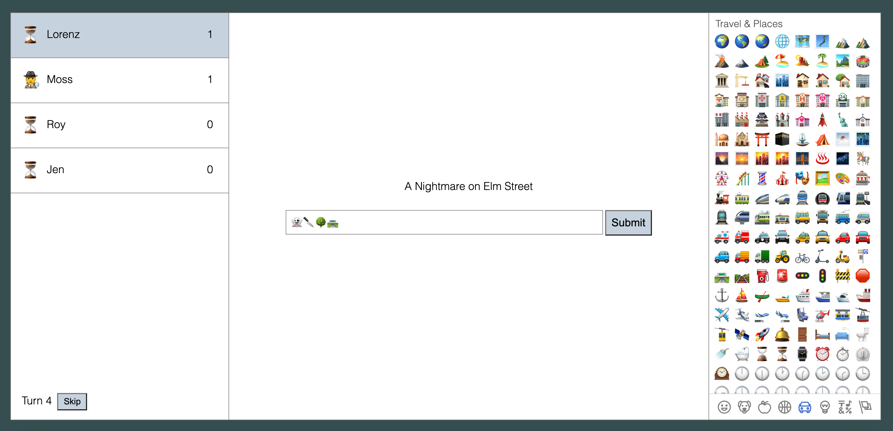

# Emojigame

This is a simple multiplayer game where you have to express a concept given by the game using only Emojis. The players take turns to guess what the emojis written by the rest of the players refer to. If that player gets it right, he receives a point and can then give another point to the person who, in his opinion, did the best job at describing the concept.

I created this during the initial lockdown in spring of 2020 with the idea of having something to play with friends during online reunions.

I tried several lists of guessing words or phrases. The most fun turned out to be movie titles. Maybe song or book titles could work too.

The game is written in ELM on the frontend and in Typescript on the Backend. It is not finished in any way.
There are still some bugs and parts of the code are a mess, but I was able to enjoy several games with friends.

## How to run it

I don't have a server set up, so if you want to play, you have to run the server yourself.

1. Clone the repository.
2. Install [nodejs and npm](https://docs.npmjs.com/downloading-and-installing-node-js-and-npm).
3. Run `npm install` to install dependencies.
4. Run `npm start` to build the app and start the server.
5. Visit `http://localhost:8999` in your browser.
6. Use for example [ngrok](https://ngrok.com/) to make the game accessible through the internet.

### Credits

The emoji picker was adapted from https://github.com/Holmusk/elmoji/tree/1.0.4

### Phrase Sets

In `server/phrasesets` there are txt-files that contain the concepts or phrases used in the game. Currently the only way to switch to a different set is by changig the code in `server/src/server.ts` and rebuilding the app. Feel free to try them and add your own.
